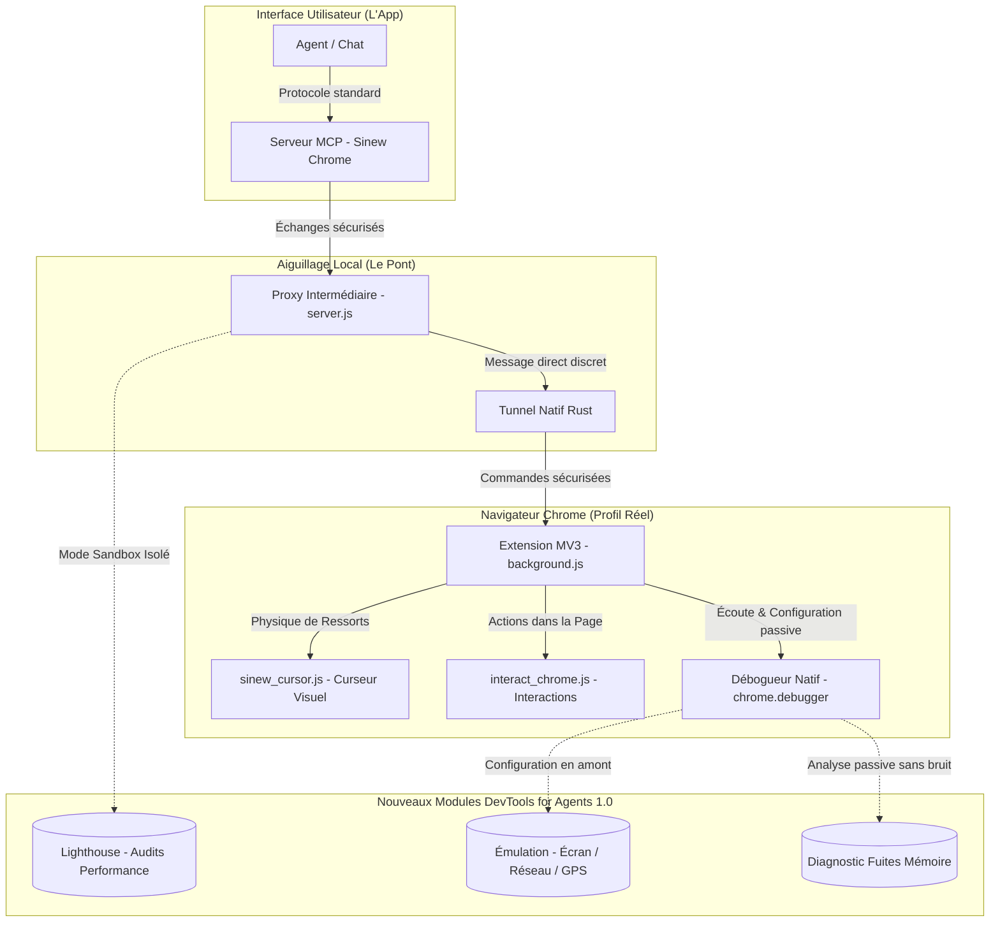

# 🧬 Analyse Technique : Intégration de Chrome DevTools for Agents dans Sinew Chrome

Ce document évalue l'opportunité et la faisabilité d'intégrer les fonctionnalités de **Chrome DevTools for Agents 1.0** (reconnexion automatique, émulation d'appareils, audits Lighthouse et diagnostic de fuites mémoire) dans notre infrastructure existante (**Sinew Chrome Bridge**), tout en garantissant la préservation absolue de notre avance unique en **simulation humaine biologique** (mouvements du curseur à base de ressorts, vitesse d'écriture naturelle et navigation indiscernable des robots).

---

## 🗺️ Visualisation de l'Architecture Hybride Ciblée

Le schéma suivant montre comment intégrer de manière sécurisée ces nouveaux outils de diagnostic sans perturber notre simulateur de comportement humain :

---

## 🔍 Évaluation des 4 Piliers de DevTools for Agents

Pour chaque fonctionnalité, nous avons analysé son utilité pratique, sa complexité de mise en œuvre et son impact sur la discrétion biologique (anti-détection) :

### 1. 🔄 Auto-Connect (Reconnexion automatique résiliente)
*   **Analogie simple :** C'est comme un fil invisible qui se renoue instantanément et sans bruit si le courant est coupé ou si la fenêtre est fermée par erreur.
*   **Intérêt :** **Très élevé.** Évite que l'agent ne reste bloqué si l'onglet crash ou si une page de transition se charge.
*   **Faisabilité technique :** **Excellente.** Notre système possède déjà un signal régulier (heartbeat de 5s) et des tentatives de reconnexion automatique toutes les 3 secondes côté extension.
*   **Impact Biologique / Furtivité :** **Aucun.** C'est un protocole de transport en arrière-plan totalement invisible pour les sites web.

### 2. 🌍 Émulation (Écran tactile, réseau lent, GPS)
*   **Analogie simple :** Configurer le navigateur pour qu'il croie sincèrement être un téléphone mobile branché en 4G dans une rue de Marseille, plutôt qu'un ordinateur puissant connecté à la fibre de bureau.
*   **Intérêt :** **Élevé.** Permet de tester la réactivité des pages mobiles et d'agir sur des interfaces adaptées au format smartphone.
*   **Faisabilité technique :** **Très forte.** Utilise les commandes natives de Chrome (`Emulation.setDeviceMetricsOverride`, `Network.emulateNetworkConditions`) envoyées directement via l'extension.
*   **Impact Biologique / Furtivité :** **Excellent.** Renforce la furtivité en faisant correspondre la vitesse et le format d'affichage à un profil humain cohérent. Notre curseur doit simplement adapter sa trajectoire (ex: simuler un doigt glissant sur l'écran plutôt qu'une souris qui survole).

### 3. 🚦 Lighthouse (Audits de performance & Accessibilité)
*   **Analogie simple :** Un inspecteur en bâtiment qui débarque pour tout tester d'un coup, secouant les portes et mesurant la plomberie, ce qui fait beaucoup de bruit et de perturbations.
*   **Intérêt :** **Moyen.** Utile pour des tâches de diagnostic d'accessibilité ou de SEO, mais inutile pour de l'action pure.
*   **Faisabilité technique :** **Moyenne.** Lighthouse nécessite un accès direct au port de débogage de Chrome. Activer ce port de manière publique est un signal facilement détecté par les systèmes anti-bots.
*   **Impact Biologique / Furtivité :** **Risque critique.** Lighthouse rafraîchit la page plusieurs fois et effectue des analyses intrusives. Les sites comme Cloudflare bloqueront immédiatement l'agent si Lighthouse tourne en direct sur un profil réel.
*   **Recommandation SOTA :** Ne jamais lancer Lighthouse sur le profil de navigation biologique actif. Si des audits sont demandés, le proxy doit ouvrir un **Chrome Sandbox jetable** en arrière-plan spécialement pour cette tâche, préservant le profil de travail principal intact.

### 4. 🧠 Diagnostic de Fuites Mémoire (Heap Profiling)
*   **Analogie simple :** Peser régulièrement le "sac à dos" du navigateur pour vérifier que les scripts des pages web ne le remplissent pas de déchets inutiles jusqu'à l'étouffement.
*   **Intérêt :** **Moyen (Limité à la QA / Développement).** Permet de repérer les pages mal codées qui font ramer le système lors de longues sessions.
*   **Faisabilité technique :** **Forte.** Le domaine `HeapProfiler` de Chrome est disponible via l'extension. Le proxy peut demander des instantanés de mémoire à chaud.
*   **Impact Biologique / Furtivité :** **Faible.** Prendre un instantané mémoire gèle temporairement le navigateur pendant une fraction de seconde, ce qui peut saccader le mouvement fluide de notre curseur biologique. Ces diagnostics doivent donc être asynchrones et déclenchés uniquement lors des phases d'inactivité du curseur.

---

## 🛠️ Plan d'Architecture & Recommandations pour l'Intégration

Pour conserver notre avance exclusive sur la simulation humaine biologique, nous recommandons une approche **Hybride Double-Couche** :

1.  **L'Extension MV3 (Couche Furtive) :** Elle reste l'unique émettrice des actions utilisateur (clics, frappes au clavier, défilements). Les trajectoires de souris en courbes de Bézier physiques restent générées localement dans la page pour éviter toute détection de "coordonnées magiques".
2.  **Le Débogueur CDP (Couche Passive & Configuration) :** Utilisé uniquement pour l'émulation initiale (taille d'écran, réseau) et les diagnostics passifs (fuites mémoire), sans jamais interférer avec le DOM en cours de navigation active.
3.  **L'Isolation Lighthouse (Mode Sandbox) :** Lancer les audits de performance dans un processus Chrome séparé, jetable et sans identifiants personnels, afin de ne jamais exposer notre profil biologique de travail aux blocages anti-bots.

---

## 🎯 Prochaines Étapes Opérationnelles

*   **Phase 1 (Immédiat) :** Mettre à jour la compétence `browser` pour intégrer des consignes d'adaptation du curseur lors d'émulations d'appareils tactiles.
*   **Phase 2 (Moyen terme) :** Ajouter au serveur MCP un outil optionnel de diagnostic de mémoire asynchrone (`get_memory_leak_diagnostics`).
*   **Phase 3 (Optionnel) :** Implémenter l'isolation de Lighthouse via un processus conteneurisé jetable à la demande.
