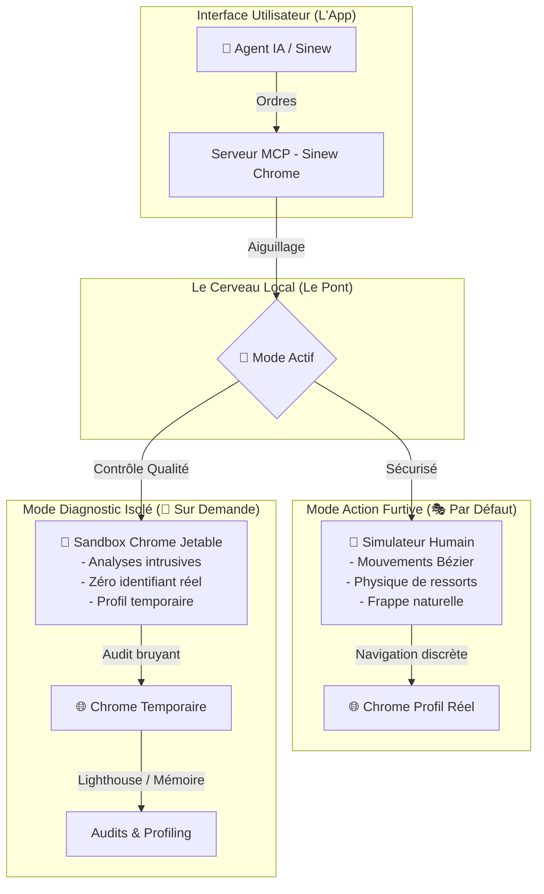

# 🔬 Pertinence des Outils de Diagnostic de Google dans Sinew Chrome
*(Par le spécialiste Diagnostic & Qualité)*

Ce rapport évalue comment intégrer les outils de diagnostic de **Chrome DevTools for Agents 1.0** (Lighthouse, émulation, fuites mémoire et auto-connexion) dans notre système de pilotage de navigateur **Sinew Chrome**, tout en gardant nos mouvements de souris et clics "biologiques" ultra-réalistes qui évitent les blocages.

---

## 🗺️ Schéma des Modes : Équilibre Furtivité & Diagnostic

Le schéma ci-dessous montre notre stratégie de séparation étanche entre la navigation active (furtive) et le contrôle qualité (diagnostic) :

---

## 🔍 Analyse Métaphorique & Pertinence des 4 Outils

### 1. 🔄 Auto-Connect (La Clé Double de votre Voiture)
*   **Analogie simple :** C'est comme prêter un double des clés de votre voiture personnelle à votre assistant virtuel. Il peut s'asseoir sur le siège passager pour vous aider directement, sans que vous ayez besoin d'acheter une nouvelle voiture vide et de refaire tous vos réglages (mots de passe, comptes connectés).
*   **Pertinence :** **Indispensable (10/10).** Permet à l'IA d'interagir immédiatement avec les sites où vous êtes déjà connecté sur votre ordinateur (derrière une double authentification bancaire ou professionnelle), sans devoir ressaisir vos identifiants.
*   **Impact sur la furtivité :** **Excellent.** Le fait d'utiliser vos cookies et votre historique de navigation réels met en confiance les sites sécurisés.

### 2. 🌍 Émulation (Le Costume de Caméléon)
*   **Analogie simple :** C'est un déguisement parfait qui fait croire à un site internet que votre ordinateur est en fait un petit smartphone branché sur une connexion lente 4G au milieu de la campagne.
*   **Pertinence :** **Très forte (8/10).** Essentiel pour tester l'affichage mobile ou s'assurer que notre site fonctionne même avec un réseau de mauvaise qualité.
*   **Impact sur la furtivité :** **Très bon,** à condition d'adapter nos gestes physiques (ex: simuler un glissement de doigt sur l'écran tactile plutôt qu'une souris classique).

### 3. 🚦 Lighthouse (Le Contrôleur Technique Automobile)
*   **Analogie simple :** C'est un inspecteur méticuleux qui débarque pour tout tester d'un coup. Il ouvre le capot, secoue les portes et fait grincer les freins. C'est extrêmement efficace pour valider la qualité du site, mais cela fait un bruit monstrueux.
*   **Pertinence :** **Forte pour le développement (7/10).** Parfait pour obtenir une liste d'actions claires afin de rendre le site plus rapide ou accessible aux personnes malvoyantes.
*   **Impact sur la furtivité :** **Risque critique (Rouge 🔴).** Les tests Lighthouse effectuent des rechargements brutaux et des analyses intrusives. Les systèmes de sécurité des sites professionnels (comme Cloudflare) détecteront instantanément ce comportement mécanique et bloqueront l'accès.
*   **Recommandation d'Intégration :** **Séparation stricte.** Ne jamais lancer Lighthouse sur votre profil Chrome principal. Notre serveur MCP doit ouvrir un navigateur temporaire vide (une "Sandbox") uniquement dédié à l'audit.

### 4. 🧠 Diagnostic de Fuites Mémoire (La Détection de Fuite d'Eau)
*   **Analogie simple :** Regarder régulièrement le compteur général d'eau pour vérifier qu'une fuite invisible ne coule pas lentement dans les murs de votre maison.
*   **Pertinence :** **Moyenne (5/10).** Très utile pour la maintenance de longs scripts JavaScript complexes afin d'éviter qu'ils ne ralentissent l'ordinateur de l'utilisateur final.
*   **Impact sur la furtivité :** **Faible.** Prendre une photo de la mémoire gèle le navigateur pendant un millième de seconde. Si l'IA est en train de bouger la souris à ce moment-là, le mouvement peut avoir un léger sursaut "robotique". L'analyse doit donc se faire asynchronement durant les temps de pause de l'IA.

---

## 🎯 Plan d'Action & Prochaines Étapes Opérationnelles

Pour équiper notre compétence de ces super-pouvoirs de diagnostic sans perdre notre immunité face aux blocages, voici notre feuille de route simple :

1.  **Mise à jour de la Compétence (`SKILL.md`) :** Enseigner à l'IA d'utiliser le simulateur de gestes humains pour franchir les formulaires complexes ou connexions, et de réserver les diagnostics DevTools uniquement aux phases de validation ou dans des onglets sandbox séparés.
2.  **Ajout de l'Émulation Mobile Furtive :** Configurer le pont pour que nos trajectoires physiques s'adaptent instantanément (passer en mode "tactile") dès que l'émulation mobile est activée.
3.  **Intégration de la reconnexion automatique résiliente :** Rendre notre système capable de reprendre une tâche de navigation interrompue sans aucune perte de contexte ou message d'erreur.
