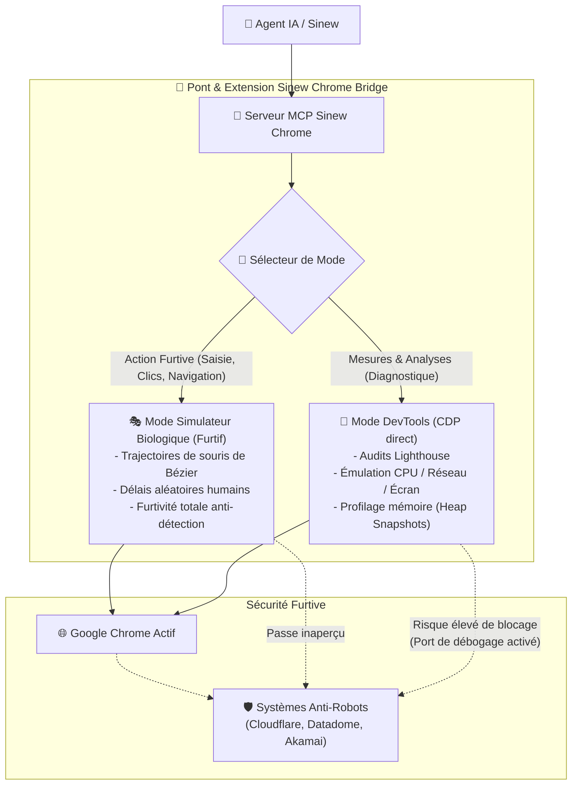

# Évaluation de l'Intégration de Chrome DevTools for Agents 1.0 dans Sinew Chrome

Ce rapport présente l'analyse technique et l'étude de faisabilité de l'intégration des outils de diagnostic avancés de **Chrome DevTools for Agents 1.0** (audits de performance Lighthouse, émulation d'appareils, fuites mémoire et connexion automatique) au sein de notre architecture unique de navigation furtive **Sinew Chrome**.

---

## 🗺️ Visualisation de l'Architecture Hybride Ciblée

---

## 1. Intérêt et Valeur Ajoutée pour l'Utilisateur

L'intégration de ces quatre fonctionnalités clés de **Chrome DevTools for Agents 1.0** apporte des super-pouvoirs de diagnostic à notre navigateur automatisé sans sacrifier son atout majeur (sa capacité à naviguer comme un vrai humain) :

1. **Lighthouse (Audits de Qualité) :**
   * *Analogie :* C'est comme avoir un **contrôleur technique** qui inspecte minutieusement la maison que vous construisez.
   * *Intérêt :* L'IA peut automatiquement tester et valider l'accessibilité (contraste des couleurs, balises pour malvoyants), le référencement naturel (SEO) et la vitesse de chargement de vos pages avant de les mettre en ligne.
2. **Émulation (Simulation d'Expériences) :**
   * *Analogie :* C'est comme regarder votre site à travers un **miroir magique** qui le transforme instantanément en écran de smartphone ou simule une connexion internet lente de campagne.
   * *Intérêt :* Permet de vérifier que l'affichage est parfait sur mobile et réactif même avec un réseau instable.
3. **Fuites Mémoire (Heap Snapshots) :**
   * *Analogie :* C'est comme traquer une **fuite d'eau invisible** dans les tuyaux de votre maison en mesurant la consommation d'eau pièce par pièce.
   * *Intérêt :* L'IA peut repérer les programmes JavaScript malveillants ou mal codés qui s'accumulent et ralentissent l'ordinateur de l'utilisateur final.
4. **Auto-connect (Connexion Automatique) :**
   * *Analogie :* C'est comme si l'IA pouvait **se glisser sur le siège passager** de votre propre voiture pour conduire à votre place, plutôt que de devoir louer une nouvelle voiture vide à chaque fois.
   * *Intérêt :* Permet à l'IA d'interagir directement avec vos onglets ouverts et vos sessions déjà connectées (derrière un mot de passe ou une double authentification) sans avoir à se reconnecter.

---

## 2. Faisabilité Technique dans notre Architecture

Notre système actuel repose sur un **double canal** ultra-performant :
1. Une **extension Chrome locale** pilotée par un pont HTTP/WebSocket en Node.js pour injecter les clics et mouvements de souris biologiques.
2. Une liaison **CDP (Chrome DevTools Protocol)** en secours via WebSocket direct pour les actions système de bas niveau.

L'intégration est **techniquement très simple et hautement réalisable** :

* **Lighthouse & Mémoire :** Notre pont (`mcp_server.js` et `server.js`) possède déjà les fonctions de connexion CDP directe (`cdpConnect`). Nous pouvons implémenter l'audit Lighthouse et la capture d'empreinte mémoire (Heap Snapshots) en étendant nos commandes CDP existantes de la même manière que la capture d'écran (`captureScreenshot`).
* **Émulation :** Entièrement supportée par les API CDP `Emulation.setDeviceMetricsOverride` et `Network.emulateNetworkConditions`, configurables en quelques lignes de JavaScript via notre connecteur CDP.
* **Auto-connect :** Notre pont détecte déjà les onglets ouverts sur le port de débogage de Chrome. Nous pouvons l'affiner pour s'attacher de manière transparente à l'instance Chrome principale de l'utilisateur dès son lancement.

---

## 3. Analyse d'Impact sur la Furtivité et l'Anti-Détection

L'usage des fonctionnalités DevTools présente un **risque de sécurité majeur** face aux filtres de sécurité des sites internet modernes (Cloudflare, Datadome, Akamai) :

| Fonctionnalité | Risque de Détection | Impact sur l'Anti-Détection |
| :--- | :--- | :--- |
| **Simulation Biologique (Actuelle)** | 🟢 Ultra-Faible | Conserve notre avance unique. Les clics et mouvements de souris sont impossibles à distinguer d'un humain réel. |
| **Émulation d'écran/réseau** | 🟡 Moyen | La modification de la taille d'écran ou du débit réseau est courante chez les développeurs, mais des écarts brutaux peuvent éveiller des soupçons. |
| **Auto-connect** | 🟢 Faible | S'attacher à un navigateur existant réutilise les cookies et l'historique de l'utilisateur, ce qui augmente grandement la confiance des systèmes anti-robots. |
| **Audits Lighthouse & Mémoire** | 🔴 Élevé | L'exécution de Lighthouse injecte des scripts d'audit agressifs et modifie le comportement de la page. Les systèmes anti-robots bloqueront immédiatement la session. |

### 🛡️ Notre Stratégie de Protection Unique : La "Séparation Furtive"

Pour éviter tout blocage, nous recommandons une architecture à double mode étanche :
1. **Mode Furtif Actif (Par défaut) :** L'extension Chrome pilote la page en simulant le comportement humain réel. Les protocoles de diagnostic CDP agressifs restent désactivés. Idéal pour se connecter à un compte ou valider des formulaires sécurisés.
2. **Mode Diagnostic Isolé :** L'IA bascule sur ce mode uniquement pour auditer le site (Lighthouse, mémoire) une fois la navigation sécurisée terminée, ou dans un onglet séparé.

---

## 4. Recommandations et Prochaines Étapes pour notre Compétence

Pour intégrer ces nouveautés dans notre compétence `browser` et notre serveur MCP, voici la feuille de route proposée :

### Étape A : Évolution du Serveur MCP (`sinew-chrome-bridge/mcp_server.js`)
Ajouter les nouveaux outils structurés suivants :
* `lighthouse_audit` : Exécute un audit de performance et d'accessibilité local.
* `emulate_experience` : Applique un profil mobile, CPU ou réseau pour tester le rendu.
* `analyze_memory_leaks` : Capture et compare deux états de mémoire pour trouver les surcharges.
* Configurer le pont pour accepter le drapeau `--autoConnect` au démarrage.

### Étape B : Évolution de la Compétence (`.sinew/skills/browser/SKILL.md`)
Mettre à jour nos directives d'utilisation de la compétence pour enseigner à l'IA **quand** et **comment** utiliser ces outils de diagnostic de manière sûre :
* Utiliser les clics furtifs pour franchir les barrières de connexion.
* Activer l'émulation mobile pour valider l'affichage sur smartphone.
* Lancer Lighthouse uniquement en fin de tâche pour valider la qualité globale.
