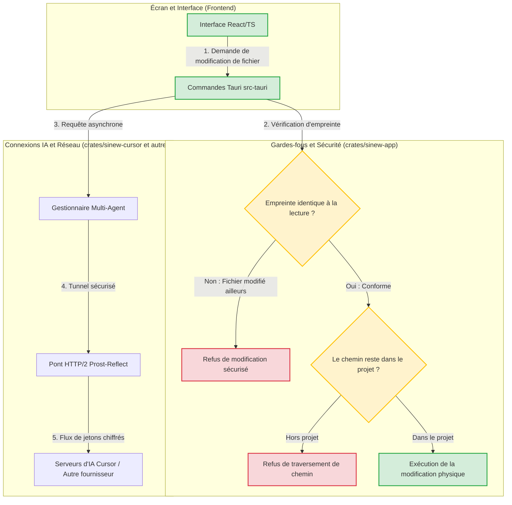

# 🦀 Rapport d'Audit du Code Rust — Projet Sinew

Ce rapport présente l'analyse approfondie et exhaustive du code Rust du projet **Sinew** (situé dans le dossier `crates/` et le dossier d'interface système `src-tauri/`).

---

## 📊 Synthèse Graphique de l'Architecture Rust (Flux de Travail)

Le diagramme suivant illustre comment le code Rust reçoit vos demandes depuis l'écran, vérifie la sécurité des accès aux fichiers, prépare les requêtes avec des gardes-fous, et gère les conversations avec les modèles d'intelligence artificielle :

---

## 🔍 Analyse Détaillée de l'Architecture Rust

### 1. Le Lanceur de Commandes PowerShell (`bash.rs`)
* **La Métaphore :** *C'est comme utiliser un bras robotique ultra-précis muni d'une pince isolante pour effectuer des tâches ménagères. Le robot ne risque pas de se faire mal ni de salir la maison.*
* **Le Fonctionnement :** Sur Windows, l'outil shell de Sinew utilise Windows PowerShell de manière hautement sécurisée. Au lieu d'écrire des commandes brutes sujettes à des erreurs d'interprétation ou d'injection de caractères spéciaux, il encode le script entier en Base64 (`-EncodedCommand`) et force l'utilisation du codage de caractères UTF-8 universel pour toutes les entrées et sorties.
* **Verdict :** **Extrêmement Robuste.** Aucune vulnérabilité ou problème d'échappement majeur identifié.

### 2. Le Système de Verrouillage des Fichiers (`edit.rs` / `read.rs`)
* **La Métaphore :** *C'est comme un gardeur de coffre-fort qui vérifie votre ticket d'entrée. Si vous avez lu la boîte aux lettres à 14h00 et que vous revenez la modifier à 14h05, il s'assure que personne d'autre n'y a touché entre-temps. Si quelqu'un y a touché, il bloque l'opération.*
* **Le Fonctionnement :** L'outil d'édition (`EditFileTool`) exige qu'une lecture réussie (`ReadTool`) ait été effectuée juste avant l'écriture. Il compare une empreinte numérique (`ReadFingerprint`) contenant la taille, la date de modification exacte et le hachage Sha256 du fichier.
* **Verdict :** **Qualité SOTA.** Ce mécanisme prévient efficacement les collisions ou les réécritures accidentelles de code obsolète par l'IA. De plus, tout segment de chemin suspect comme les dossiers parents (`..`) est immédiatement stoppé au niveau du décodeur pour éviter de modifier des fichiers en dehors du dossier de travail.

### 3. Le Tunnel Réseau Multi-Agent (`sinew-cursor`)
* **La Métaphore :** *Un standardiste téléphonique qui connecte les lignes. Si la ligne directe ultra-rapide (HTTP/2 natif Rust) ne fonctionne pas, il peut rediriger l'appel vers un second boîtier (le sous-processus NodeJS), mais uniquement si vous l'y autorisez.*
* **Le Fonctionnement :** Le pont réseau pour connecter Cursor utilise par défaut un client HTTP/2 natif en Rust (`agent.v1` avec `prost-reflect`). L'authentification par double jeton OAuth est obligatoire et le stockage local des secrets utilise des structures d'empreinte bien distinctes. Le pont NodeJS secondaire n'est activé que sur demande expresse de débogage local (`SINEW_CURSOR_BRIDGE=node`).
* **Verdict :** **Très propre.** L'architecture découplée évite d'exécuter des processus système NodeJS superflus en arrière-plan pendant votre utilisation normale.

---

## ⚠️ Points d'Attention et Opportunités d'Amélioration

Bien que le code soit de très haute qualité, deux améliorations techniques permettraient d'en accroître les performances et d'optimiser l'expérience utilisateur :

### A. Fatigues de la Boucle de Travail (I/O Synchrone Bloquant)
* **La Métaphore :** *Imaginez un chef de cuisine très occupé qui s'arrête en plein service pour aller chercher lui-même une carotte au marché à l'autre bout de la ville, au lieu de demander à un commis de la lui apporter. Pendant ce temps, toute la cuisine est à l'arrêt.*
* **Le Problème :** Les fonctions d'accès aux fichiers (lecture, écriture, métadonnées dans `read.rs` et `write.rs`) effectuent des appels de lecture sur le disque de manière synchrone en plein milieu de fonctions asynchrones. Sous Windows, si le disque est occupé ou très lent, cela peut geler momentanément d'autres tâches en cours de l'application.
* **Solution :** Utiliser la fonction de déchargement de Tokio (`spawn_blocking`) pour confier ces tâches de lecture/écriture de fichiers physiques à des commis (threads) secondaires dédiés, gardant la boucle principale d'affichage totalement fluide.

### B. Ouverture Répétitive de la Boîte à Outils (SQLite Churning)
* **La Métaphore :** *Ouvrir et refermer à clé votre boîte à outils chaque fois que vous devez prendre un simple tournevis, pour la refermer aussitôt et la réouvrir 1 seconde plus tard.*
* **Le Problème :** Le système d'indexation ouvre et referme une nouvelle connexion à la base de données SQLite pour chaque petite tâche de vérification. Sur Windows, ces ouvertures et fermetures répétées créent une surcharge inutile pour le système.
* **Solution :** Maintenir une connexion ouverte et active pour la durée de la session de travail et activer le mode d'écriture rapide de SQLite (WAL - Write-Ahead Logging).

---

## 🏆 Bilan de l'Audit Rust

| Composant Audité | Niveau de Robustesse | Niveau de Sécurité | Recommandation |
| :--- | :--- | :--- | :--- |
| **Exécuteur de Terminal (`bash.rs`)** | 🟢 SOTA / Excellent | 🟢 Très Élevé | Conserver tel quel. |
| **Garde-fous des Fichiers (`edit.rs`)** | 🟢 SOTA / Excellent | 🟢 Très Élevé | Conserver tel quel. |
| **Pont Cursor Réseau (`sinew-cursor`)** | 🟢 Excellent | 🟢 Élevé | Conserver tel quel. |
| **Système de fichiers (Tokio)** | 🟡 Correct | 🟢 Très Élevé | Décharger l'I/O via `spawn_blocking`. |
| **Indexation (`SQLite`)** | 🟡 Correct | 🟢 Très Élevé | Optimiser le cache et le mode WAL. |
