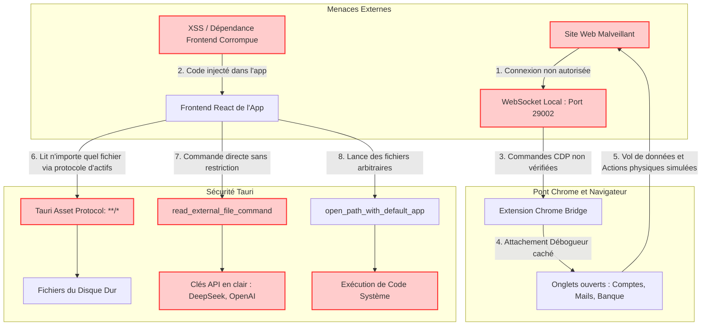

# 🛡️ Rapport d'Audit de Sécurité — Projet Sinew

Ce rapport présente l'analyse de sécurité exhaustive de l'architecture générale, de la configuration **Tauri**, du système de permissions et du **Pont d'Extension Chrome** de l'application Sinew.

---

## 📊 Synthèse Graphique des Risques (Flux de Menaces)

Le diagramme suivant montre comment un site web malveillant ou une faille visuelle (XSS) peut exploiter l'absence de barrières pour s'emparer de vos données privées et exécuter des commandes système :

---

## 🔍 Analyse Détaillée des Failles Identifiées

### 1. Absence de vérification d'origine sur le Pont Chrome (Risque Majeur)
* **Métaphore :** *C'est comme avoir une porte dérobée ouverte sur la rue arrière de votre maison, sans verrou ni interphone. N'importe quel passant peut entrer et prendre le contrôle de vos affaires.*
* **Mécanique technique :** Le serveur proxy local dans `server.js` écoute sur le port `29002` pour des liaisons WebSocket (`/devtools/browser` ou `/extension`) sans valider l'en-tête `Origin` ou exiger de jeton d'authentification. 
* **Impact :** N'importe quel site internet malveillant visité par l'utilisateur dans son navigateur classique peut établir une connexion WebSocket locale vers `ws://localhost:29002/devtools/browser` et envoyer des commandes à l'extension. L'attaquant peut ainsi attacher silencieusement le débogueur Chrome à vos onglets actifs (banques, e-mails, profils de développement), simuler des clics et voler vos cookies ou identifiants de session.

---

### 2. Protocole de fichiers Tauri trop permissif (Risque Élevé)
* **Métaphore :** *C'est comme donner un pass général (passe-partout) de tout l'immeuble à un invité qui n'a besoin d'accéder qu'à une seule chambre.*
* **Mécanique technique :** Dans `tauri.conf.json`, le paramètre `app.security.assetProtocol.scope.allow` est configuré à `["**/*"]` avec `requireLiteralLeadingDot` désactivé.
* **Impact :** La page frontend de l'application Tauri est autorisée à charger absolument n'importe quel fichier local de votre ordinateur. Si une vulnérabilité d'injection de scripts (XSS) ou une dépendance tierce compromise est présente dans l'interface, elle pourra aspirer n'importe quel fichier de votre disque dur (comme votre clé SSH privée ou vos documents) via le protocole d'actifs de Tauri.

---

### 3. Commande de lecture de fichiers arbitraires sans contrôle (`read_external_file_command`)
* **Métaphore :** *C'est un guichet postal qui donne le contenu de n'importe quelle boîte aux lettres de la ville à n'importe qui en demande le chemin, sans jamais demander de pièce d'identité.*
* **Mécanique technique :** Le fichier `src-tauri/src/workspace.rs` expose la fonction `read_external_file_command` en tant que commande Tauri. Elle prend un chemin absolu brut fourni par le frontend et lit le fichier directement sur le disque.
* **Impact :** Bien que l'interface utilise cette commande pour l'action légitime de "CMD+clic" dans le terminal pour afficher un fichier externe, le backend n'effectue aucun contrôle d'accès ni approbation. Un script malveillant dans l'interface peut invoquer cette commande pour exfiltrer vos fichiers système sensibles en arrière-plan.

---

### 4. Clés d'API et jetons stockés en clair sur Windows
* **Métaphore :** *C'est comme coller vos mots de passe importants sur un post-it collé sur votre écran. N'importe qui s'asseyant à votre bureau peut les recopier instantanément.*
* **Mécanique technique :** Les jetons d'accès et clés d'API (OpenAI, DeepSeek, OpenRouter, Cursor) sont stockés sous forme de fichiers JSON textuels simples dans `%LOCALAPPDATA%\hyrak\sinew\data`. Sur Windows, la fonction de protection des fichiers (`apply_permissions`) est vide (`Ok(())`), n'appliquant aucune restriction NTFS (contrairement aux versions Mac/Linux qui limitent la lecture avec `chmod 0o600`).
* **Impact :** Tout autre programme ou script s'exécutant sur le compte de l'utilisateur (y compris des logiciels malveillants légers ou scripts de scraping) peut lire directement ces fichiers en clair et voler vos crédits d'API.

---

### 5. Exécution libre d'applications système (`open_path_with_default_app_command`)
* **Métaphore :** *C'est comme laisser le tableau de bord d'une grue de chantier sans surveillance et accessible à n'importe quel passant.*
* **Mécanique technique :** La commande `open_path_with_default_app_command` permet au frontend de demander le lancement de n'importe quel fichier ou chemin système avec l'application par défaut.
* **Impact :** Un attaquant exploitant une faille frontend peut forcer le système à exécuter des scripts malveillants locaux ou ouvrir des fichiers exécutables dangereux.

---

## 🛠️ Recommandations pour Sécuriser Sinew

Pour verrouiller l'application sans nuire à son fonctionnement d'assistant intelligent, voici le plan d'action préconisé :

1. **Sécuriser le Pont Chrome (WebSocket) :**
   * **Solution :** Générer un jeton secret unique (par exemple un UUID) au démarrage de l'application Tauri. 
   * **Mécanique :** Transmettre ce jeton à la fois à l'extension Chrome (via le canal de messagerie natif sécurisé) et au proxy. Exiger que toutes les connexions WebSocket ou requêtes HTTP vers le port `29002` fournissent ce jeton secret en paramètre de connexion ou d'en-tête. Refuser instantanément tout accès qui ne présente pas le secret.
   * **Vérification d'origine :** Rejeter systématiquement les connexions WebSocket qui ne proviennent pas d'une origine de confiance.

2. **Restreindre la portée d'actifs Tauri (Asset Scope) :**
   * **Solution :** Dans `tauri.conf.json`, limiter la portée de l'Asset Protocol uniquement au dossier de l'espace de travail en cours (`workspace_root`) ou le désactiver si le chargement direct d'actifs arbitraires n'est pas strictement requis.

3. **Demander une validation utilisateur pour les actions sensibles :**
   * **Solution :** Pour la commande `read_external_file_command` et le lancement d'applications externes via `open_path_with_default_app_command`, afficher une invite de dialogue système Tauri demandant explicitement l'autorisation de l'utilisateur avant d'agir (ex: *"Sinew souhaite accéder au fichier externe C:\...\config.json. Autoriser ?"*).

4. **Chiffrer les clés d'API locales sur Windows :**
   * **Solution :** Utiliser les API natives de Windows de coffre-fort (DPAPI - Data Protection API) pour chiffrer les fichiers de configuration contenant les secrets d'API, de manière à ce qu'ils ne soient pas lisibles en clair par d'autres logiciels du système.
