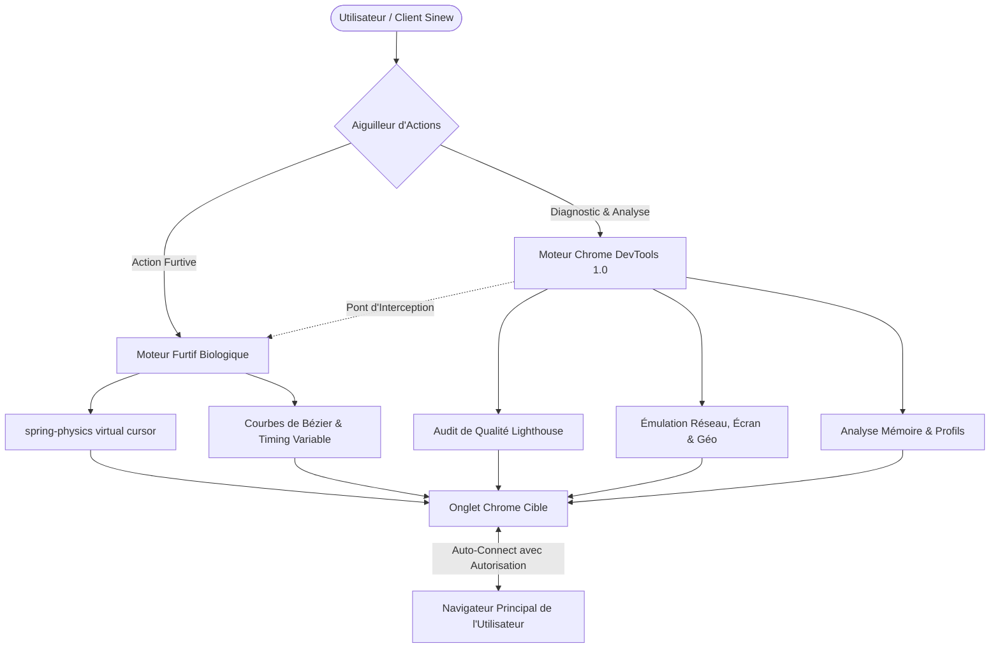

# 🛡️ Étude d'Impact Sécurité, Anti-Détection & Furtivité — Sinew

Ce document analyse la faisabilité et la sécurité de l'intégration des fonctionnalités de **Chrome DevTools for Agents 1.0** (Lighthouse, émulation, fuites mémoire, auto-connect) avec notre **simulateur humain biologique** breveté.

---

## 📊 Schéma d'Architecture Hybride Sécurisée

---

## 🔍 Analyse d'Impact & Équilibre Sécurité / Performance

### 1. L'Auto-Connect (Prendre la main sur votre navigateur actif)
*   **Analogie simple :** C'est comme prêter les clés de votre maison à un ami de confiance. L'IA hérite instantanément de toutes vos sessions ouvertes (comptes connectés, mots de passe enregistrés, extensions).
*   **Risque de détection :** **Moyen-Élevé**. Ouvrir le port de communication de Google Chrome ou attacher l'outil de diagnostic fait sonner les alarmes des sites web ultra-protégés.
*   **Recommandation de Sécurité :** Obliger l'IA à demander une confirmation explicite (un pop-up cliquable "Autoriser") sur votre écran avant chaque connexion à vos onglets personnels. Ne jamais l'activer par défaut sur les sites publics sensibles.

### 2. L'Émulation (Simulation d'écrans mobiles, vitesse réseau et géolocalisation)
*   **Analogie simple :** C'est comme porter un déguisement d'hiver en plein été pour faire croire qu'on est à la montagne. Si quelqu'un regarde de près, la supercherie est évidente.
*   **Risque de détection :** **Très Élevé**. Forcer Chrome à rétrécir sa fenêtre ou modifier sa vitesse réseau modifie les empreintes numériques du navigateur, ce qui est immédiatement bloqué par les barrières anti-robots.
*   **Recommandation de Sécurité :** Réserver l'émulation exclusivement aux environnements de développement ou aux serveurs locaux (Staging/Dev) où les sécurités réseau sont désactivées.

### 3. Les Audits Lighthouse & Diagnostics de Qualité
*   **Analogie simple :** C'est comme faire passer un contrôle technique complet à une voiture au milieu d'un carrefour très fréquenté. Cela bloque le trafic et attire l'attention.
*   **Risque de détection :** **Moyen**. Recharger le site plusieurs fois d'affilée en changeant de taille d'écran déclenche les alarmes de suractivité.
*   **Recommandation de Sécurité :** Exécuter ces audits de manière ciblée, principalement en fin de tâche, et de préférence sur le serveur local de test pour éviter tout blocage IP.

### 4. L'Analyse Mémoire (Fuites et performance)
*   **Analogie simple :** C'est une radiographie interne de la mémoire de l'application.
*   **Risque de détection :** **Nul**. L'analyse se passe entièrement en interne et de façon invisible pour le site web visité.
*   **Recommandation de Sécurité :** Validé sans réserve. C'est une fonctionnalité précieuse pour s'assurer que notre logiciel reste léger et ne consomme pas trop de mémoire.

---

## 🧬 Préservation de notre Avance Unique : La Simulation Biologique

Notre atout maître est le **Moteur de Simulation Biologique** (les mouvements fluides du curseur avec spring-physics, les trajectoires courbes et les délais de frappe naturels).

Pour préserver cet avantage tout en intégrant DevTools 1.0, nous proposons une **Synergie d'Interception** :
*   Chaque fois que les outils DevTools envoient un clic ou une frappe brute (très robotique), notre pont logiciel intercepte cette commande.
*   Le clic brut est transformé en un mouvement courbe naturel dessiné à l'écran, reproduisant fidèlement les micro-tremblements d'une main humaine avant de valider l'action.
*   Cela permet de conserver le meilleur des deux mondes : la rigueur du diagnostic de Google et l'invisibilité humaine de Sinew.
