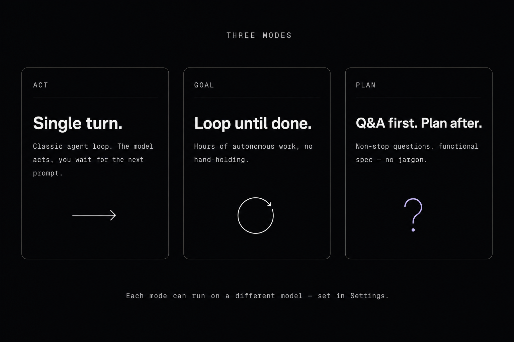
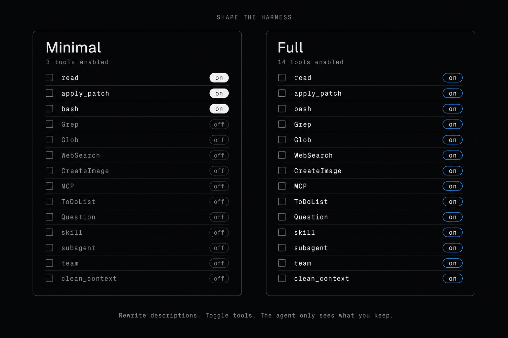
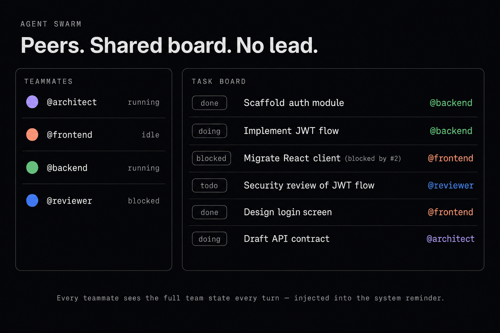
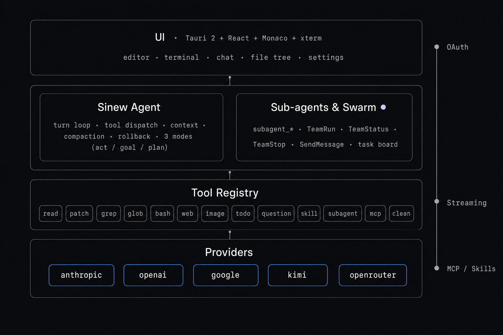

<p align="center">
  
</p>

<p align="center">
  <a href="https://github.com/Paseru/sinew/releases/latest"></a>
  <a href="./LICENSE"></a>
  <a href="https://github.com/Paseru/sinew/actions"></a>
  <a href="https://github.com/Paseru/sinew/releases"></a>
  <a href="https://discord.gg/MADQNHtZW"></a>
</p>

<p align="center">
  <b>Sinew</b> is a desktop AI coding harness you can actually reshape.<br/>
  Every tool is toggleable, every description is editable, every provider is pluggable,<br/>
  and the agent only sees the surface area you keep.
</p>

<p align="center">
  <code>tauri 2</code> · <code>react</code> · <code>rust</code> · <code>monaco</code> · <code>xterm</code> · <code>mcp</code>
</p>

---

> [!NOTE]
> **OAuth providers — a quick heads-up, then chill ✌️**
>
> Sinew can sign you in to **Codex**, **Claude Code** and **Antigravity** through their native OAuth flow, so you can plug Sinew into the subscription you already pay for instead of double-paying through an API key.
>
> - **Codex (OpenAI)** — fully in-bounds. The Codex CLI is open-source (Apache 2.0) and its OAuth flow is part of the publicly supported tooling, so third-party clients using it sit on solid ground.
> - **Claude Code (Anthropic)** and **Antigravity (Google)** — the same OAuth flow is technically reserved for their own first-party clients. So in theory, those providers *could* flag accounts using it through a third-party harness.
>
> In practice: **no ban has ever been reported to us**, and this is the exact same approach every other open-source coding agent out there uses (opencode, crush, and friends). We track the upstream clients closely and ship updates fast whenever the flow shifts — so what Sinew sends keeps looking like a normal first-party session and stays clear of any flagging heuristics.
>
> Want to stay 100% sanctioned? Every provider also works with a plain **API key** or through **OpenRouter** — both fully in-bounds usages. Pick the path that feels right. Use at your own risk, but honestly: stay chill.

---

## 🚀 Présentation des Fonctionnalités Majeures (Fork Premium julienpiron.fr)

Cette version a été optimisée en profondeur pour offrir une expérience utilisateur haut de gamme (SOTA), une autonomie maximale en arrière-plan, et des intégrations d'intelligence artificielle inégalées.

### 🎨 Interface, Confort & Ergonomie (Premium UI)
* **Animation de démarrage premium :** Une animation de boot moderne, fluide et élégante à l'ouverture de l'application.
* **3 niveaux de réflexion :** Choix entre Détaillé, Compact ou Très compact pour configurer précisément la verbosité de l'IA et le masquage des détails techniques dans le chat.
* **Question collante (Sticky Question) :** La question en cours de traitement reste épinglée en haut de l'écran pendant que vous faites défiler le fil de discussion.
* **Menu clic droit interactif sur les onglets de l'éditeur :** Clic droit (ou `F10`) sur les onglets pour fermer l'onglet (raccourci `Ctrl+F4`), les autres, à sa droite ou tous, copier le chemin (absolu ou relatif) et révéler dans le Finder/Explorateur.
* **Menu clic droit d'exécution :** Clic droit sur les fichiers dans le chat et l'arbre des fichiers pour les ouvrir, les révéler ou les exécuter directement.
* **Polices dynamiques ajustables :** Boutons tactiles réactifs (`+` et `-`) dans les options pour ajuster instantanément à chaud la taille du texte de l'éditeur Monaco et du chat.
* **Version française complète :** L'interface entière et toutes les actions de l'application s'adaptent automatiquement en français ou en anglais.
* **Sélection et copie libre :** Déblocage de la sélection et copie de texte directement dans le fil de discussion du chat.
* **Démarcation visuelle :** Ligne de séparation verticale élégante à gauche du panneau de configuration des paramètres.
* **Découpage du bundle Vite (-80% de taille) :** Monaco Editor et xterm.js sont isolés dans des sous-lots séparés pour un chargement instantané de l'interface utilisateur.
* **Visualisation du plan d'action (Planning Board) :** Intégration d'un bloc dynamique interactif (`PlanningNextMoveBlock`) montrant en temps réel les prochaines étapes planifiées par le Swarm d'agents.
* **Aperçu d'image immersif (Lightbox) :** Visionneuse d'images de discussion immersive avec zoom à la molette de souris, déplacement panoramique, rotation, téléchargement et fermeture par clic extérieur.

### 💾 Autonomie, Sauvegarde & Robustesse Système
* **Sauvegarde automatique (Auto-Save SOTA) :** Enregistrement automatique et transparent en arrière-plan 1,5 seconde après l'arrêt de la frappe. Activable ou désactivable d'un clic dans vos options.
* **Mode Sandbox :** Lancement de l'application en un clic sans aucun projet ouvert pour tester l'IA ou utiliser les outils MCP de manière isolée.
* **Synchro OneDrive & SQLite automatique :** Synchronisation transparente de vos conversations, configurations de projets, jetons de connexion/clés d'authentification (`*-auth.json`, `*-device.json`, `*-stream-state.json`), fichiers d'apprentissage globaux (`errors_raw.json` et `instructions_consolidated.md`), et bases de données SQLite entre vos différents ordinateurs.
* **Zéro popup console Windows :** Lancement asynchrone et silencieux de tous les outils, serveurs MCP, commandes Git et diagnostics SOTA en arrière-plan sans aucune ouverture de fenêtres d'invite de commandes.
* **Préfixe PC réel automatique :** Identification automatique du nom de la machine physique pour typer et sécuriser les configurations de conversation multi-PC.
* **Diagnostic Windows OAuth résilient :** Capture robuste de l'erreur réseau typique sous Windows (code 10013) et conseils clairs pour débloquer la connexion (WinNAT/HNS).
* **Diagnostic SOTA :** Vérification en un clic de l'état de santé, du PATH et des versions de tous vos outils de développement (Git, Python, Node, Cargo, etc.).
* **Écran de mises à jour sécurisé (`UpdaterLockScreen`) :** Verrouillage de l'interface pendant l'application des correctifs système pour éviter tout conflit de fichiers ou corruption de base de données.
* **Script de compilation OneDrive (`compil.ps1`) :** Automatisation de la génération de l'application et copie immédiate sur OneDrive pour un déploiement instantané sur vos PC.
* **Active Turn Registry :** Moteur intelligent Rust qui suit les turns de l'agent en cours et assure une reprise instantanée du streaming.
* **Fiche de transmission structurée (Compaction d'IA) :** Compactage automatique du contexte lors du changement de fournisseur d'IA dans une fiche structurée reprenant le statut des fichiers modifiés, le relais des tâches et les diagnostics du linter.
* **Mode plein gaz adaptatif (`crates/sinew-index/src/store.rs`) :** Optimisation dynamique des performances de l'indexeur augmentant le cache et la lecture en mémoire lorsque la machine dispose d'un stockage SSD/NVMe.
* **Indexation locale parallèle SOTA :** Préparation et analyse des fichiers en parallèle répartie sur tous les coeurs de CPU disponibles via Rayon, avec détection immédiate et saut des fichiers inchangés grâce à leurs empreintes de taille et date.
* **Identification de projet universelle :** Association automatique des conversations au dépôt Git distant (remote origin URL) ou via un fichier d'identifiant unique `.sinew/project_id.txt` pour lier instantanément vos conversations d'un PC à un autre sans aucune action manuelle, avec détection, liaison et rafraîchissement dynamique des conversations provenant de PC alternatifs depuis les paramètres.
* **Gestion des mises à jour configurables :** Option à 3 choix (Bloquant, Notification, Désactivé) pour décider précisément du niveau de vérification des nouvelles versions de Sinew et empêcher l'écrasement de vos modifications.
* **Script de contrôle qualité unifié (`scripts/check.ps1`) :** Commande unique `npm run check` exécutant le build frontend, `cargo check`, les tests, `clippy` et les audits de dépendances en une seule opération.
* **Système d'apprentissage global transparent :** Chargement et injection automatique de la base d'instructions centralisées de l'utilisateur (`%LOCALAPPDATA%\Sinew\instructions_consolidated.md`) dans le prompt système de tous les agents pour l'ensemble des projets ouverts sur la machine.
* **Consolidation automatique de la mémoire :** Mécanisme au démarrage transformant automatiquement les erreurs répétées enregistrées dans `errors_raw.json` en règles d'apprentissage globales permanentes dans `instructions_consolidated.md` avec nettoyage du compteur d'erreurs.
* **Bouton de synchronisation forcée :** Ajout d'un bouton de synchronisation immédiate à la demande dans les paramètres pour déclencher manuellement la synchronisation du dossier OneDrive local.

### 🤖 Modèles d'IA, Comptes & Furtivité (AI Engine)
* **Gestion Multi-comptes OpenAI & Google Gemini :** Connexion simultanée de plusieurs profils OpenAI et Google Gemini secondaires avec bascule instantanée entre vos différentes clés, comptes et abonnements.
* **Quotas en temps réel :** Visualisation dynamique de votre consommation (crédits / balance restante) sous forme de barres de progression colorées adaptatives dans les options, et pastille live dans le chat.
* **Routage & Résilience Google Antigravity SOTA :** Réparation, de-surcharge réseau (erreur 503), routeurs de secours et transition transparente entre modèles avec résolution dynamique des identifiants d'appels d'outils (tool_call_id).
* **Optimisation de vitesse Gemini :** Streaming et requêtes ultra-rapides pour les modèles Gemini.
* **Incorporation de Claude Opus 4.8 & 4.6 :** Intégration complète de Claude Opus 4.8 (contexte 1M natif) et Claude Opus 4.6 via les abonnements professionnels Google.
* **Système Pending/Steering pour Influencer :** Un vrai système d'interception et de guidage pour orienter, corriger ou ajouter des instructions en temps réel sans blocage du flux de l'IA.
* **Indexation sémantique locale vectorielle :** Indexation et recherche vectorielle haute-performance effectuée localement sur votre machine avec commutateur d'activation directe (BETA) dans le panneau d'options.
* **Intégration de DeepSeek R1 & V3 :** Support complet de **DeepSeek V3** et de **DeepSeek R1** avec capture et rendu en temps réel du bloc de réflexion (*reasoning*) grâce à l'extraction du champ `reasoning_content` dans le chat.
* **Pont Cursor Composer 2.5 (agent.v1) :** Moteur haute-performance autonome sur connexions HTTP/2 persistantes gérant toutes les modifications chirurgicales de fichiers, avec installation automatique et invisible en arrière-plan, et masquage du sélecteur d'intelligence inutile.
* **Sécurité & Furtivité WebSocket :** Spoofing d'empreinte réseau avancé pour éliminer tout risque de détection ou de blocage sur les flux de ChatGPT.
* **WebSocket OpenAI :** Transport temps-réel haute performance basé sur WebSocket pour des réponses fluides et à latence minimale avec OpenAI.

### 🔌 Extensions & Ponts locaux (MCP & Bridge)
* **Extension Chrome nouvelle génération :** Pilotage d'actions de navigation ultra-stables en natif Rust avec mouvements et clics à vitesse humaine (mouvements Beziers, physique fluide) et mode silencieux.
* **Réparation Chrome en un clic :** Bouton bleu de configuration automatique si le pont Chrome ne répond pas sur un nouveau PC.
* **Empaquetage des ressources Tauri :** Le pont local et l'extension Chrome sont intégrés directement au sein de l'installateur compilé (MSI/EXE).
* **Outils Rust & ripgrep Sidecar :** Intégration de Ripgrep en binaire natif sidecar et de nouveaux outils (`list_dir`, `delete_file`) pour accélérer la recherche et la gestion des fichiers par 10x.
* **Diagnostics Monaco en temps réel :** Remontée automatique des lints et erreurs de compilation de l'éditeur de code à l'IA en temps réel.
* **Logs ultra-compacts :** Nettoyage automatique du contexte de discussion pour éliminer le bruit et optimiser la consommation de jetons.
* **Laboratoire réseau MITM :** Outils de débogage et d'ingénierie inverse intégrés pour inspecter le trafic chiffrés des outils IA.
* **Moteur de remplacement intelligent (Search/Replace) :** Système d'auto-correction à 8 couches (Unicode, indentations, etc.) garantissant que les modifications de l'IA s'insèrent correctement dans vos fichiers même en cas de légères erreurs d'espaces.
* **Outils MCP de diagnostics Chrome avancés :** Intégration de nouveaux outils d'audit (`emulate_experience`, `lighthouse_audit`, `analyze_memory_leaks`) basés sur l'API CDP pour tester les performances, diagnostics Lighthouse et fuites mémoire en local.

---

## Contents

- [The three modes](#the-three-modes) — Act, Goal, Plan
- [`AGENTS.md` & `DESIGN.md`](#agentsmd--designmd) — system prompt injection
- [Multi-provider, one harness](#multi-provider-one-harness) — Anthropic, OpenAI, Google, Kimi, OpenRouter, Ollama
- [Real-time Quota Monitoring](#real-time-quota-monitoring) — OpenAI Codex, Antigravity, OpenRouter
- [Tools](#tools) — the agent's toolset
  - [`clean_context`](#clean_context) — the model cleans its own context
  - [`bash` / `bash_input`](#bash--bash_input) — PTY-backed shell sessions
  - [Why dedicated `read`, `glob`, `grep`](#why-dedicated-tools-for-read-glob-and-grep)
  - [`read`](#read) · [`glob`](#glob) · [`grep`](#grep) · [`edit_file`](#edit_file) · [`write_file`](#write_file)
  - [`web_search`](#web_search) · [`web_fetch`](#web_fetch) · [`create_image`](#create_image)
  - [`question`](#question) · [`todo_list`](#todo_list)
  - [`load_mcp_tool`](#load_mcp_tool) · [`skill`](#skill)
- [Sub-agents](#sub-agents) — configurable specialised agents
- [Agent swarm](#agent-swarm) — peer-to-peer team of 2–8 agents
- [Compaction](#compaction) — auto and manual
- [Rollback](#rollback) — checkpointed conversation
- [Display modes](#display-modes) — technical reasoning density
- [SOTA System Diagnostics](#sota-system-diagnostics) — real-time local dependency audit
- [Architecture](#architecture)
- [Screenshot](#screenshot)
- [OAuth credentials](#oauth-credentials)
- [Community](#community)
- [License](#license)

---

## The three modes

<p align="center">
  
</p>

### Act

The normal mode: the agent runs a classic single-turn loop. You prompt, it acts, control comes back to you.

### Goal

The agent runs in a loop until the task is finished. It can keep going for hours, autonomously, without hand-holding.

### Plan

A non-stop question / answer session. The agent explores the code, asks you a question, you answer, it explores some more, asks another, and so on. It **never exits the loop on its own** — the plan is only written when **you** click **"Send and stop questions"**.

The produced plan contains no technical jargon: no code, no code map, no file list. That's a deliberate choice. After a lot of A/B against the plans produced by Claude Code, Codex and friends, the ones that work best describe the **functional** layer — what the app should do — without dictating the technical structure.

For a game, for example, the plan describes the expected experience, not the directory tree. Otherwise the agent burns all its reasoning **before** it ever touches code, and ends up boxed inside a structure forced from the start. By staying functional, you free its creativity at build time — it gets to decide how to structure things.

It's only constrained technically if the user wants to impose a specific stack.

> The Plan mode prompt is fully editable in the **Settings** panel — so the harness adapts to how you work, not the other way around.

---

## `AGENTS.md` & `DESIGN.md`

Sinew supports two reference files at the root of the workspace, and **injects them automatically into the model's system prompt**.

**`AGENTS.md`** — general instructions for the agent: project conventions, constraints, things to avoid, etc. It's the equivalent of a README you write for the model rather than for a human. Open convention popularised by Codex and shared with a whole ecosystem of other tools — one file works everywhere. For comparison, `CLAUDE.md` (Anthropic's own convention) is **explicitly ignored** in favour of this common standard.

**`DESIGN.md`** — the project's design system: colours, typography, components, UI rules, etc. Convention introduced by Google. Sinew injects it with a dedicated header so that your product, UX, visual and frontend decisions respect the design system you use, whatever it is.

Both files get a dedicated icon in the file tree.

---

## Multi-provider, one harness

Sinew supports five model providers, each with its own connection method:

| Provider | Method |
|---|---|
| **Anthropic** | subscription |
| **OpenAI** | subscription |
| **Google** | subscription |
| **Kimi** | subscription |
| **Ollama** | local server |
| **OpenRouter** | API key |

### OAuth mode — the real differentiator

When you connect to Anthropic, OpenAI, Google or Kimi via OAuth, Sinew uses **your existing subscription directly** (Claude Max, ChatGPT Plus / Pro, etc.) with its own harness. No API key to provide, no metered billing — you're already paying the subscription anyway, you might as well use it.

### No ecosystem lock-in

Claude Code is limited to Anthropic models. Codex to OpenAI models. Sinew isn't locked anywhere: you can connect several providers in parallel and pick the right model for the right task.

### Mix models by capability

Model selection happens at three levels:

- **Per mode.** Act, Plan and Goal can each have their own dedicated model in Settings. Typically: a large model for Plan (reasoning), a solid one for Act (execution), a fast one for Goal (long loop).
- **Per sub-agent.** Each configured sub-agent has its own model (see the sub-agents section).
- **Per teammate** in an Agent Team, through sub-agent profiles.

---

## Real-time Quota Monitoring

Sinew is equipped with a built-in real-time quota tracking engine, letting you monitor your usage and limits directly inside the Settings and connection panels without leaving the harness.

Depending on the provider, three distinct tracking systems are implemented:

- **OpenAI Codex Quotas (ChatGPT Subscription)**: When connected via OpenAI OAuth, Sinew automatically pulls your active ChatGPT Plus/Pro rate limits directly from the official backend APIs. It tracks remaining requests in your primary (short) and secondary (long) windows, complete with exact reset timelines.
- **Antigravity Quotas (Google Cloud Code / Gemini)**: When authenticated via Google OAuth, Sinew interfaces with Gemini's active developer platform quotas, mapping active rate-limit groups and returning precise remaining request/token percentages and reset times.
- **OpenRouter Credits**: For API-key-based OpenRouter connections, the harness queries the `/auth/key` endpoint to extract your total credit limit, credits used, and exact remaining USD balance (or indicators for unlimited keys).

### Dynamic Visual Cues
To ensure you are never surprised by rate-limiting, progress bars in the Settings panel are dynamically color-coded based on your remaining percentage:
- **Green (>80% remaining):** Comfortable headroom.
- **Blue (>50% remaining):** Stable usage.
- **Pink (>20% remaining):** Reaching limits soon.
- **Red (<20% remaining):** Critically low; throttle imminent.

---

## Tools

The agent has access to a full set of tools:

| Tool | Role |
|------|------|
| `bash` | Run shell commands |
| `bash_input` | Send input to an interactive shell session |
| `read` | Read files |
| `glob` | Find files by pattern |
| `grep` | Search text / regex in files |
| `edit_file` | Edit existing files with ordered search/replace operations |
| `write_file` | Write complete files with overwrite guardrails |
| `web_search` | Web search |
| `web_fetch` | Fetch the contents of a URL |
| `create_image` | Generate images |
| `question` | Ask the user questions |
| `todo_list` | Manage a task list |
| `clean_context` | Clean useless tool results out of the context |
| `load_mcp_tool` | Load an external MCP tool |
| `skill` | Load a skill on demand (active when skills are present) |
| `subagent_*` | Delegate a task to a configured sub-agent (one tool per enabled sub-agent) |
| `team_run` | Launch an agent team |
| `team_status` | Inspect the team's state |
| `team_stop` | Stop one agent or the whole team |
| `send_message` | Send a message between agents |

Each tool can be **individually disabled** in Settings, which lets you go from a full-featured setup down to a minimalist one (CLI-style, à la Pi Code). Every tool description is also **editable**, which gives you another lever to tweak the harness.

<p align="center">
  
</p>

---

### `clean_context`

Sinew is the only coding agent where the model can **clean its own context**. None of the others — Cursor, Claude Code, Codex, Cline — offers this.

The tool takes a list of `tool_call_id`s from the current turn. For each one, the content of the result is replaced in history by an ultra-short placeholder (`[Tool result cleaned by you: irrelevant to future context.]`). The agent does its own mental housekeeping, by itself.

The tool description is written so the agent only deletes results that are **really** useless: explorations that went nowhere, paths it looked at and discarded, fruitless searches. Anything it cited, referenced, or used to make a decision stays. And when in doubt, it keeps.

Two guardrails:

- The tool only touches results **from the current turn** (no retroactive purge of older context).
- The placeholder stays visible — the agent knows there used to be a result here that it chose to throw away. **No silent forgetting.**

And that "current turn only" limit solves a problem many people will anticipate: **prompt caching**. If we touched older tool results, we'd break the prefix cached by the provider, and every subsequent turn would replay at full price. Here, the current turn isn't cached yet, so we can purge it without losing anything on the billing side. **You gain context without sacrificing the cache.**

Why this is game-changing: tool results blow up the context very fast. A `glob` can return hundreds of paths, a `read` up to 500 lines, a `grep` a mountain of matches. On an exploration turn, most of that is noise. Without `clean_context` that noise piles up — especially in Goal mode where the context grows quickly. With it, the agent lives in a context that stays constantly cleaned of dead-end exploration.

---

### `bash` / `bash_input`

`bash` runs a shell command, `bash_input` interacts with an ongoing session.

On macOS / Linux: Bash. On Windows: PowerShell (the system prompt warns the model about the syntax difference).

The interesting bit: if a command doesn't finish right away, Sinew returns a `session_id` and lets the process keep running. The agent can then send input, poll the output, or kill the session. PTY-backed, so `vim`, `top`, a REPL or a dev server actually work.

On the UI side, each command shows up in a card that displays the exact input and the raw shell output, untransformed.

---

#### Why dedicated tools for `read`, `glob` and `grep`?

Some agents like Codex rely on the terminal for most everyday operations — reading a file, searching text, listing paths. The agent has to compose the right shell command every time. Sinew does the opposite: these operations get their own dedicated tools.

The idea: a shell command returns everything raw, with no way to force a limit, and the output is often noisy. A dedicated tool lets us **control exactly what comes out** — clean response, readable, no redundancy. And since it covers the same flexibility as the equivalent shell command, you don't lose any expressivity.

---

### `read`

Reads a file. Three parameters: `path`, `limit` and `offset`.

The twist: **`limit` is required**. Unlike other coding agents that leave it optional, Sinew forces the model to declare how many lines it wants. That preserves the agent's context and pushes it to target what's actually useful rather than vacuum everything up. If it needs to see more, it widens the limit and asks again. And the smarter models get, the better they exploit constraints like this in their favour.

Here's what the agent receives after a `read` on a React component:

```
path: src/components/Button.tsx
total: 124

  1 | import { forwardRef } from "react";
  2 | import clsx from "clsx";
  3 |
  4 | type ButtonProps = {
...
```

A header with the path and the total line count, then the requested lines, numbered.

And that's Sinew's whole philosophy: give the **minimum useful information**, no redundancy. Just the path, the total line count (so the agent knows where it is and can paginate), and each line numbered. Nothing more. The model figures out the rest — target, cross-reference, widen if needed.

---

### `glob`

Finds files in the workspace by pattern. Three parameters: `pattern`, `limit` and `path`.

Same rule: **`limit` is required**.

The implementation sits on top of **ripgrep**.

Here's what the agent receives after a `glob` on `src/**/*.tsx`:

```
matches: 42
shown: 25

src/components/Button.tsx
src/components/Input.tsx
...
```

Two counters: **`matches`** (the total found) and **`shown`** (how many are actually displayed). If they differ, it knows it was truncated and can either refine the pattern or widen `limit`. Same logic throughout: minimal signal, but exactly the signal that's needed.

---

### `grep`

Searches text or a regex in the workspace files. Seven parameters: `pattern`, `limit`, `path`, `include`, `output_mode`, `unique`, `exclude_pattern`.

Same rule: **`limit` is required**.

The implementation sits on top of **ripgrep**. The `include` parameter scopes the search to a file type (`*.tsx`, `*.rs`, etc.), and `path` accepts an array to target several subdirectories in a single call.

The **`output_mode`** parameter lets the agent pick the result shape based on its need, rather than filter or parse afterwards:

- `context` *(default)* — grouped by file with line number + content
- `matches` — only the matched strings
- `files` — only the paths of matching files
- `count` — number of matches per file

Two complementary filters:

- **`unique`** dedups output lines (especially useful with `output_mode=matches`)
- **`exclude_pattern`** is an anti-match: a regex that excludes lines whose content matches it. Handy to drop tests, comments, or other noise without contorting the main pattern.

Here's what the agent receives after a `grep` on `forwardRef` filtered to `*.tsx` (`context` mode):

```
matches: 12
files: 3
shown: 8

src/components/Button.tsx
  42 | const Button = forwardRef(...)
  87 | export default Button;

src/components/Input.tsx
  15 | const Input = ...
...
```

Three counters in the header: **`matches`** (total matches), **`files`** (number of files involved), **`shown`** (in case of truncation). And the results are **grouped by file** instead of the flat `file:line:text` format — same idea as RTK for those who know it: more readable and more compact for the agent to consume.

---

### `edit_file`

Edits existing workspace text files with ordered search/replace operations. The agent sends top-level `files` grouped by file:

```json
{
  "files": [
    {
      "path": "src/foo.ts",
      "edits": [
        {
          "oldContent": "const oldName = value;",
          "newContent": "const newName = value;",
          "replaceAll": false
        }
      ]
    }
  ]
}
```

`oldContent` must be non-empty. By default it must match once in the file's current content at that step; if it appears multiple times, the agent adds surrounding context until it is unique. The matcher first tries exact text, then falls back to whitespace-/punctuation-tolerant matching for common formatting drift. Set `replaceAll: true` on a replacement to replace every non-overlapping occurrence found at that step. `newContent` may be empty to delete the matched block.

The tool requires a successful prior `read` and refuses to write if the file changed since that read. Multiple replacements in the same file are applied sequentially in memory, so each edit sees the result of the previous edit; the file is still written only once after the full plan succeeds.

### `write_file`

Writes a complete text file with `path` and `content`.

It creates new files directly, including parent directories. If the file already exists, the agent must read it first; `write_file` refuses to overwrite if the file changed since that read. For targeted changes, the agent should prefer `edit_file`.

---

### `web_search`

Two providers to choose from, configurable in Settings.

**LinkUp** *(paid, API key required)* — the more powerful one. On LinkUp's side, an LLM receives the query, runs the search, and **synthesises a natural-language answer with numbered inline citations**, plus a list of sources (up to 12) with their excerpts. Two modes: `standard` for a direct answer, `deep` for complex multi-source research. The agent can then chain with `web_fetch` to drill into a specific source.

**Exa** *(free, public MCP)* — classic search. Returns a list of results with titles, URLs and content excerpts. It's what most other coding agents that offer web search rely on.

---

### `web_fetch`

Fetches the contents of a URL — typically a source returned by `web_search`. Single parameter: `url`.

The page is converted to clean Markdown before it reaches the agent.

---

### `create_image`

Image generation, via **GPT Image 2** (OpenAI) or **Nano Banana 2** (Google), your choice in Settings. In both cases the agent controls the usual parameters (size, format, quality, etc.).

For GPT Image 2, two auth modes: either an **OpenAI API key**, or directly your **ChatGPT subscription** with no API key needed.

---

### `question`

A question tool inside the chat. Classic: the agent can send one or several questions at once, in `single_choice` or `multiple_choice` form.

---

### `todo_list`

The agent's todo list. A single tool does everything: add, modify, mark as done, or delete a task.

The difference with Cursor, Claude Code, Codex and the rest: in their tools the todo is just another tool call. When the agent invokes it, the result stays in the conversation and eventually drowns under the tool calls that follow.

Sinew **re-injects the full state at every turn into the system reminder**. The model therefore always sees the up-to-date version in front of its eyes, no matter what happened since. That's what changes everything on long tasks — typically in Goal mode, where without it the agent would lose the thread.

---

### `load_mcp_tool`

Sinew supports the MCP protocol. Servers are configured in Settings.

But, unlike what you might expect, **MCP tools are not exposed directly** to the agent. What lives in the system prompt is just a **compact catalog** inside the `load_mcp_tool` description:

```
Load one MCP tool before calling it. Available MCP tools:
- Context7 / query-docs
- Context7 / resolve-library-id
- Linear / create_issue
- Linear / search_issues
...
```

The agent calls `load_mcp_tool` with a `server` and a `tool`. From that point on, the tool in question is loaded into the conversation for good, with its full description and input schema. It can then use it normally.

Why the gymnastics? The classic MCP problem: if you connect several servers (Context7, Linear, Notion, GitHub…), you can end up with 50+ tools, each with a verbose description and an input schema. Dumped as-is into the system prompt, that eats thousands of tokens **before the agent even starts working**.

With lazy-load via catalog: only a `server / tool` index stays permanently in the prompt, the full schemas only inject on demand, and once loaded a tool stays available for the whole conversation.

---

### `skill`

Same logic as `load_mcp_tool`, but for **skills**. The tool only appears in the system prompt **if at least one skill is discovered** on the machine or in the workspace.

Its description carries a compact catalog:

```
Load one skill by name before using it. Available skills:
- pdf-extraction
- review-checklist
- release-notes
...
```

The agent calls `skill` with a `name`, Sinew reads the `SKILL.md` of the requested skill and injects its content into the conversation. Same benefit as MCP: no skill takes up prompt space until it's explicitly loaded.

**Four discovery locations**, from highest priority to lowest:

1. `<workspace>/.agents/skills/`
2. `<workspace>/.sinew/skills/`
3. `~/.agents/skills/` *(global, follows the user)*
4. `~/.sinew/skills/`

Each skill is a directory containing a `SKILL.md` file.

The `.agents/skills/` format is deliberately aligned with the **Claude Agent Skills convention**: a skill written for Claude works in Sinew as-is, and vice-versa. The `.sinew/skills/` namespace stays available for project-specific skills.

Skills can be individually enabled or disabled in Settings.

---

## Sub-agents

Sinew lets you configure as many **sub-agents** as you want in Settings, each with its own `name`, `description`, system `prompt`, `model`, and an `enabled` flag. Every enabled sub-agent is exposed to the main agent as a tool named `subagent_<id>` (e.g. `subagent_security-reviewer`, `subagent_doc-writer`). The tool description reuses the one you set in Settings, and the schema reduces to a single free-form `prompt`.

When the main agent calls a sub-agent, Sinew launches a **full real turn** with the sub-agent's model and prompt, and the whole harness stays active: standard tools, `clean_context`, `todo_list`, MCP, skills, all of it. The sub-agent works in isolation, then returns a result to the main agent.

Two ways to use it:

1. **Direct delegation (one-shot).** The main agent calls `subagent_<id>` for a focused task. Handy for handing off a precise job to a specialised prompt or model without changing the global harness.
2. **Inside an Agent Team.** You assign a teammate to a sub-agent profile through `agent_profiles` in `team_run`. The teammate then inherits the sub-agent's prompt and model (see the next section).

---

## Agent swarm

<p align="center">
  
</p>

The main agent can launch a **team of 2 to 8 agents** to work together on an objective. No lead agent, no hierarchy: all teammates are peers and coordinate themselves through shared state.

Each teammate can inherit a **sub-agent profile** pre-configured in Settings (with its own prompt and model). You don't pick a model on the fly for a teammate — you assign one of the profiles you already defined.

### Difference with Claude Code Agent Teams

Claude Code follows a **lead / sub-agents** model: a main agent dispatches work to specialised sub-agents that execute their task and report back. It's effective for short orchestration, but it stays hierarchical.

Sinew follows a **peer-to-peer** model: no lead, the teammates collaborate autonomously. More powerful for long, parallel tasks, where each agent needs to make progress without waiting for a conductor.

The obvious risk of a flat team with no lead is drift — agents going in diverging directions, or stepping on each other. Sinew defuses that with the mechanisms below.

### Coordination — everything flows through the system reminder

At every turn of every teammate, Sinew injects into its system reminder:

- **The full team state** (`<agent_team_state>`): who is who, each teammate's status (`running`, `idle`, `error`…), the whole task board, and the most recent file changes. Each agent therefore sees, at all times, what the others are doing, without having to dig through its own context.
- **Messages received from other teammates** (`<queued_peer_messages>`): when a teammate sends a `send_message`, the recipient receives it at the start of its next turn via the reminder. No message lost in the conversation, no risk of being buried under further tool calls.

Same philosophy as `todo_list`: important state is never "somewhere in history", it's **always fresh in front of the model's eyes**.

Example of what a teammate receives in its system reminder at the start of a turn:

```
<agent_team_state>
team: refactor-auth | you: @backend
teammates:
- @backend [running] you
- @frontend [running]
- @reviewer [idle]
tasks:
- #1 [completed] @backend Extract the auth module into a dedicated crate
- #2 [in_progress] @backend Implement the new JWT flow
- #3 [blocked] @frontend Migrate the React client to the new endpoint (blocked by #2)
- #4 [pending] @reviewer Security review of the JWT flow
recent file changes (newest -> oldest):
newest -> @backend edit_file modified crates/auth/src/jwt.rs (+128 -42)
            @backend write_file added crates/auth/src/lib.rs (+86 -0)
oldest -> @frontend edit_file modified src/lib/api.ts (+12 -8)
</agent_team_state>

<queued_peer_messages>
<teammate-message teammate_id="@frontend" to="@backend">
When the /auth/refresh endpoint is ready, tell me the exact response contract so I can adapt the client.
</teammate-message>
<teammate-message teammate_id="@reviewer" to="*">
Heads-up: I'm starting my review in 10 min, please push your latest commits to the refactor-auth branch.
</teammate-message>
</queued_peer_messages>
```

### Task board with dependencies

The shared board supports explicit dependencies (`blockedBy`). A blocked task can't be claimed or started until its dependencies complete — auto-unblock fires automatically when they do. That prevents teammates from stepping on each other in workflows that require an order.

### Swarm tools

- `team_run` *(main agent side)* — launch a team with an objective, named teammates, an initial task board, and optionally per-teammate prompts or sub-agent profiles.
- `team_status` *(main side)* — inspect the state of the active team.
- `team_stop` *(main side)* — stop one teammate, or the whole team.
- `send_message` *(teammate side)* — DM another teammate, or broadcast to all agents in the team.
- An internal `task_list` tool lets teammates manipulate the shared board (create, update, claim, delete).

---

## Compaction

Sinew handles two modes of conversation compaction.

**Automatic** — triggered on its own when the context window fills up. The history is summarised to free room and let the agent keep going.

**Manual** — triggered from a button in the UI. The twist: you can attach an **optional directive** to steer compaction towards a specific topic ("keep mostly what concerns X", etc.). The cleanup is then more aggressive on everything outside the requested topic.

---

## Rollback

In the chat, **every past user message is clickable**. Clicking it opens a preview listing all files modified by the agent since that message, and offers to rewind to that point of the conversation.

Before confirming, a **toggle** lets you choose:

- **Revert** the workspace changes (files are restored to their previous state)
- **Keep** the changes as-is (you only undo the chat history)

Sinew then deletes all subsequent user / assistant messages, and optionally restores the files. The conversation can resume cleanly from that point.

Under the hood, each turn records a *checkpoint* that captures the before / after state of the files it touched — that's what makes revert possible at any past point.

---

## Display modes

Sinew features a customizable display mode selector (*Mode d'affichage*) in the General Options, allowing you to configure the density of **AI thinking processes** (reasoning blocks) and **tool execution details** (bash output, file reads/writes, grep searches) displayed in the chat.

The interface offers three density levels:

- **Detailed (*Détaillé*)** — Full visibility. AI reasoning blocks remain open after streaming. Tool calls are rendered in full detail. File modifications (`edit_file`, `write_file`) bypass the standard card wrappers and render their complete, raw line-by-line diffs (`FileChangeBlock`s) directly in the chat stream for maximum technical auditability.
- **Compact** — A clean, balanced view. AI reasoning blocks automatically collapse once streaming is finished, showing only a small summary header (e.g. *Thinking (5.2s)*). All successful tool executions, **including file modifications**, are collapsed into single-line clickable card headers. Diffs and code outputs are hidden by default, but can be expanded manually with a single click. Long outputs inside cards are capped to a max-height of 180px with a scrollbar to keep the chat tidy.
- **Very Compact (*Très compact*)** — The cleanest layout. AI reasoning blocks are visible during generation, then **disappear completely** once finished. All successful, completed tool executions (including file edits and reads) are **filtered out of the chat entirely** (0 pixels used). Only errors, questions from the agent, and the final text responses from the AI remain visible, allowing you to focus purely on the results.

---

## SOTA System Diagnostics

Sinew features a built-in real-time **SOTA System Diagnostics** utility in the Options panel to ensure your environment is fully configured for state-of-the-art agent operations.

- **How it works** — Clicking the **Refresh (*Actualiser*)** button queries the local operating system, verifies execution health, resolves absolute system paths, and extracts version details of all crucial development tools (Git, Node.js, Npm, Cargo, Rustc, Python, Pip, and Ripgrep).
- **Why it matters** — These dependencies are directly used by Sinew:
  - **Git** powers the conversation rollback and automatic background Git commits.
  - **Ripgrep (`rg`)** provides blisteringly fast codebase indexing and regex searches.
  - **Python & Pip** run advanced Model Context Protocol (MCP) servers and AI-assisted scripts.
  - **Node.js, Npm, Rustc & Cargo** handle application runtime, sidecar compilation, and build pipelines.

---

## Architecture

<p align="center">
  
</p>

- **`src/`** — React UI (Monaco editor, xterm terminal, chat, settings, file tree).
- **`src-tauri/`** — Tauri 2 shell, IPC commands, workspace I/O, conversation store, checkpoint store.
- **`crates/sinew-core`** — Provider-agnostic types: messages, tools, streams, model definitions.
- **`crates/sinew-app`** — Agent loop (Act / Goal / Plan), tool implementations, swarm, MCP, compaction, rollback.
- **`crates/sinew-{anthropic,openai,google,kimi,openrouter}`** — Provider adapters (auth, wire, streaming).

---

## Screenshot

<p align="center">
  
</p>

---

## OAuth credentials

Provider OAuth client IDs (and Google's client secret) are embedded in the source. This follows the standard practice for "installed applications" — the same approach used by tools like `gcloud`. These credentials are not treated as secret in this context.

---

## Community

- [Discord](https://discord.gg/MADQNHtZW) — chat, support, share your harness configs
- [Issues](https://github.com/Paseru/sinew/issues) — bugs and feature requests
- [Discussions](https://github.com/Paseru/sinew/discussions) — design, providers, MCP

---

## License

[MIT](./LICENSE)

<p align="center">
  <sub>Built with Tauri, Rust, and a stubborn refusal to ship a black-box harness.</sub>
</p>
