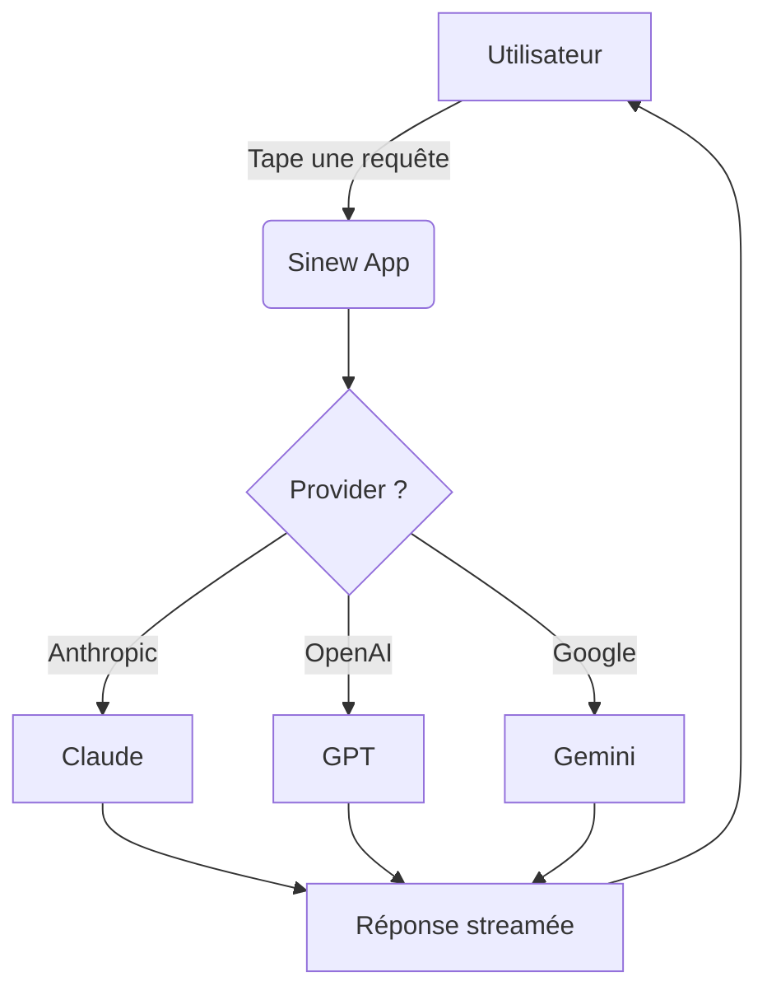
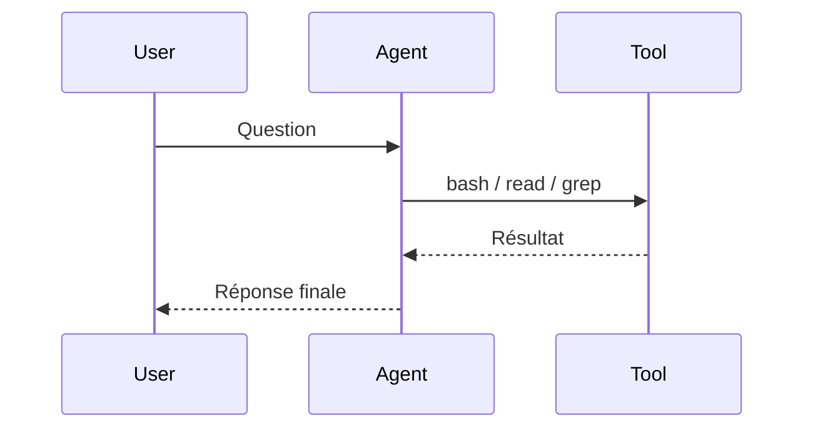
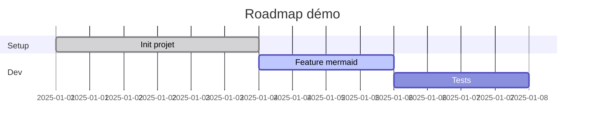

# Test Mermaid 🧜

Petit fichier de démo pour voir si le rendu Mermaid marche.

## 1. Flowchart simple

```mermaid
graph TD
    A[Utilisateur] -->|Tape une requête| B(Sinew App)
    B --> C{Provider ?}
    C -->|Anthropic| D[Claude]
    C -->|OpenAI| E[GPT]
    C -->|Google| F[Gemini]
    D --> G[Réponse streamée]
    E --> G
    F --> G
    G --> A
```

## 2. Diagramme de séquence

```mermaid
sequenceDiagram
    participant U as User
    participant A as Agent
    participant T as Tool
    U->>A: Question
    A->>T: bash / read / grep
    T-->>A: Résultat
    A-->>U: Réponse finale
```

## 3. Petit Gantt

```mermaid
gantt
    title Roadmap démo
    dateFormat  YYYY-MM-DD
    section Setup
    Init projet      :done,    a1, 2025-01-01, 3d
    section Dev
    Feature mermaid  :active,  a2, 2025-01-04, 2d
    Tests            :         a3, after a2, 2d
```

